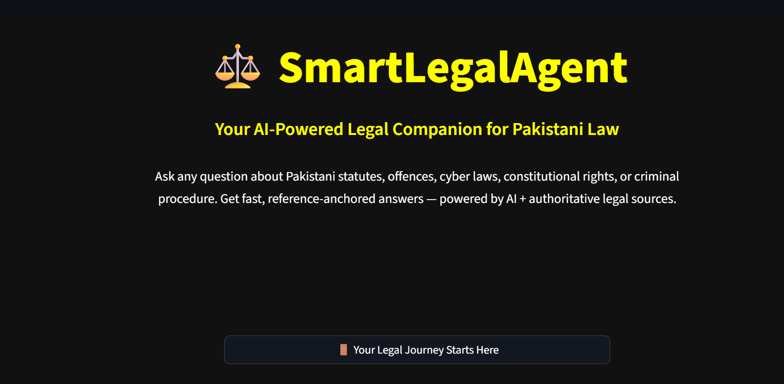
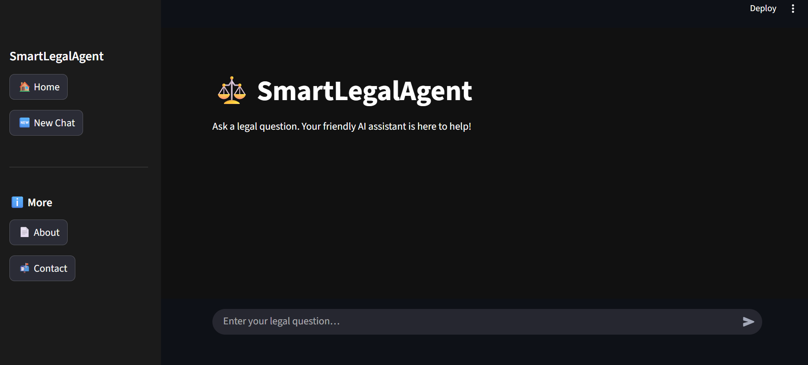
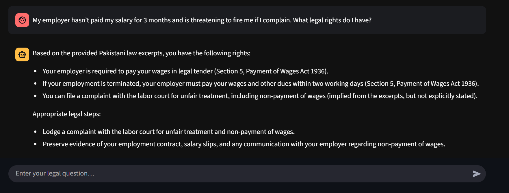
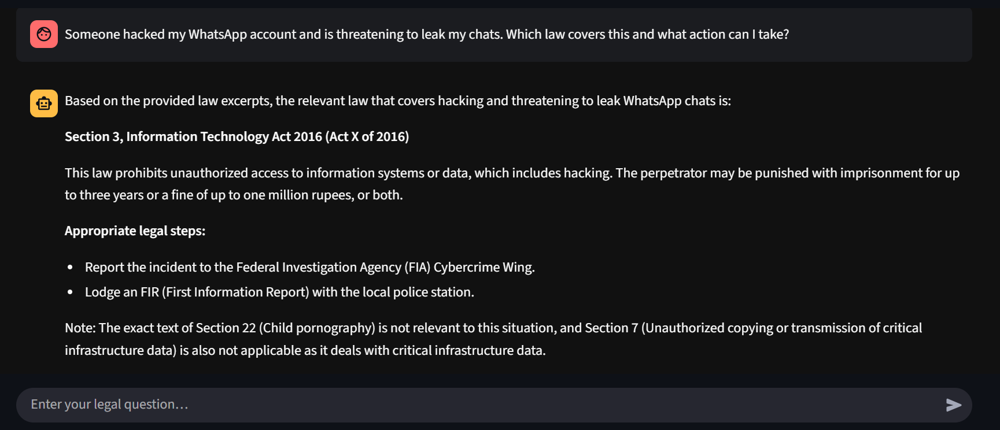
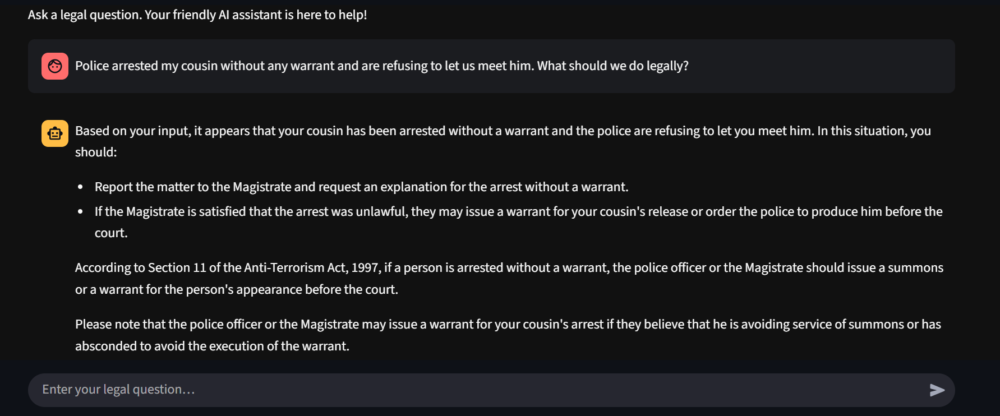
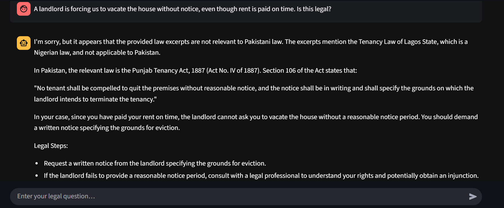

# ⚖️ SmartLegalAgent – AI-Powered Legal Assistant for Pakistani Law

---

## 📌 What is SmartLegalAgent?

**SmartLegalAgent** is an advanced AI-powered legal assistant built using **LangGraph**, designed to answer questions about **Pakistani law** in a natural, conversational way. It retrieves relevant **Sections, Acts, and legal references** and provides actionable guidance for users.

This is **not just a chatbot** – it’s a **LangGraph-based hybrid RAG agent** that uses **AI + Legal Knowledge Base** to ensure context-aware, accurate responses.

---

## ✅ Key Features
- 🏛 **Conversational Legal Assistance** – Ask questions like *"What is Section 21 of PECA?"* or *"Police arrested my cousin without a warrant, what should I do?"*
- 📚 **RAG (Retrieval-Augmented Generation)** – Combines LLM power with legal database.
- 🔍 **Contextual Citations** – Cites relevant **Sections & Acts** from Pakistani law.
- 💬 **ChatGPT-Style Interface** – Clean, intuitive UI with chat history and easy navigation.
- 🖥 **Landing Page + Chat Mode** – Professional branding with a welcoming landing screen.
- 🔐 **Cybercrime & Digital Laws Coverage** – PECA 2016 and related laws included.
- ⚙ **Fully Modular** – Built on LangGraph for multi-node processing (Router, Legal Q&A, Fallback, etc.).

---

## 🛠 Tech Stack
- **Frontend:** [Streamlit](https://streamlit.io) (Custom CSS for UI/UX)
- **Backend:** [LangGraph](https://www.langchain.com/langgraph)
- **Language Models:** LLaMA 3 & Mistral-7B (via OpenRouter)
- **Retrieval Tool:** [Tavily](https://tavily.com) for web-based legal context
- **Database:** CSV-based law reference DB (extendable to SQL/Vector DB)
- **Other Tools:** dotenv for environment management, logging utilities

---

## 📷 Screenshots

### 🏠 Landing Page

### 💬 Chat Interface

### ✅ Sample Legal Answer

### ✅ Another Example Answer

### 🔍 Scenario-Based Response

### 🔍 Another Scenario Example

---

## ⚠️ Disclaimer
This is a **demo version** of the project. Here, a **sample file is loaded** for illustration purposes.  
All **working modules, extended datasets, and backend files** will be provided **upon collaboration**.  

This tool is intended **for educational purposes only** and is **not a substitute for professional legal advice**. Always consult a licensed lawyer for case-specific guidance.

---

## 📬 Contact
**Developer:** Syed Saad Ali  
📧 Email: **syedsaadi427@gmail.com**  

---

