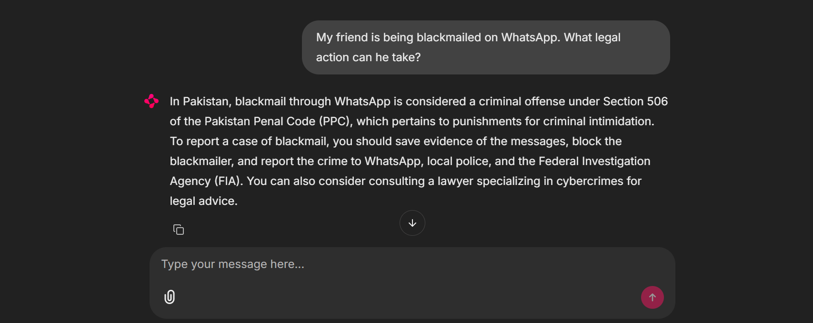
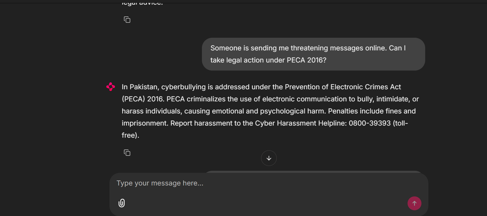
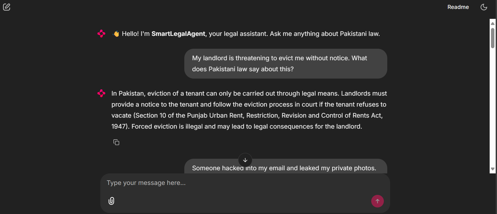
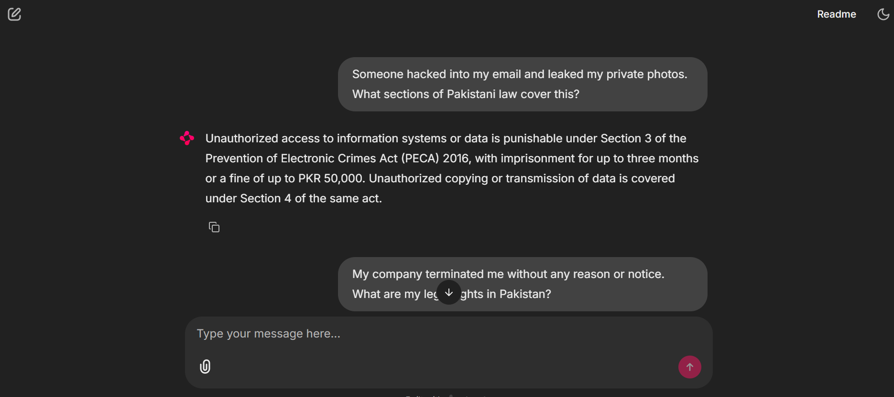
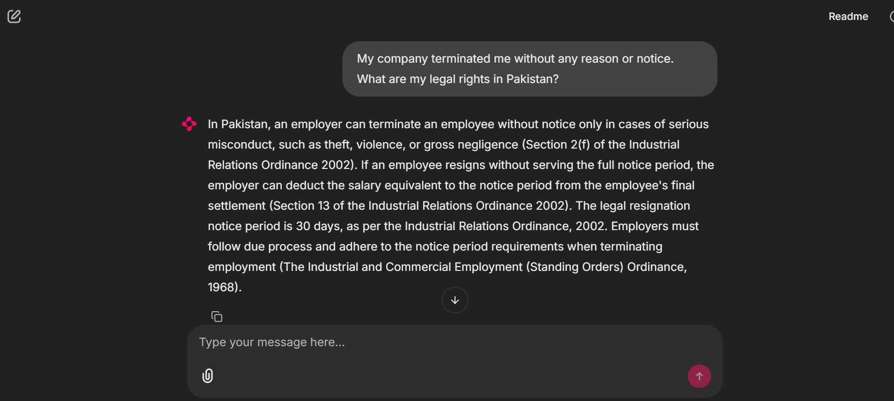
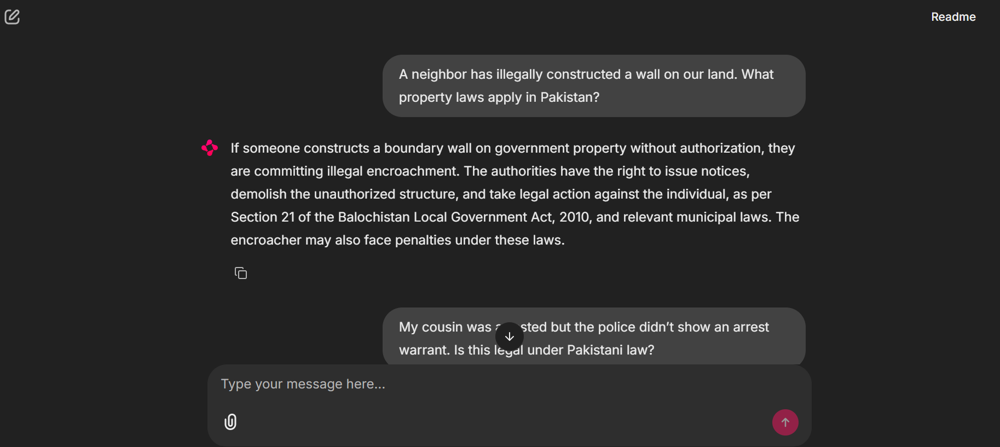
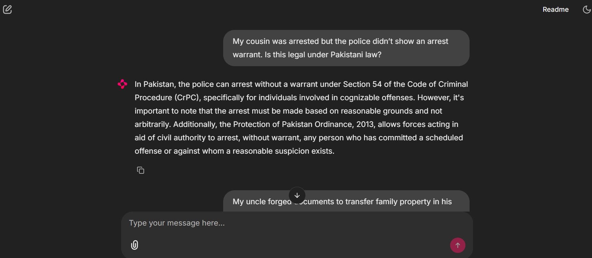

# ⚖️ SmartLegalAgent

Powered by **LangChain** and **Mistral-7B Instruct**, this legal assistant provides concise answers rooted in Pakistani law.

**SmartLegalAgent** is an AI-powered legal assistant trained specifically on **Pakistani law**. It uses a hybrid **RAG (Retrieval-Augmented Generation)** architecture to provide **concise, authoritative, and section-cited legal answers** based on both internal law documents and recent web content.

> 🛡 Built to assist in legal understanding, not to replace human legal counsel.

---

## 🎯 Key Features

- 💬 **Chat-style Legal Q&A Interface** using [Chainlit](https://www.chainlit.io/)
- 🧠 **RAG-based Response Generation**: combines semantic search + live web info
- 📚 **Embedded Legal Knowledge** across diverse Pakistani law domains
- 📄 **Section & Act Citation** enforcement in all answers
- 🌐 **Web Integration** to enhance outdated or uncovered queries
- 🚫 **Foreign Law Detection**: blocks non-Pakistani law questions gracefully

---

## 🧠 Architecture Overview

### 🔁 Hybrid RAG Flow

1. **User asks a legal question**
2. 🔍 **Vector Search** over embedded Pakistani legal documents (via Chroma DB)
3. 🌐 **Web Search Tool** pulls relevant online results (optional supplement)
4. 🤖 **LLM Agent** receives both sources and strict system instructions:
   - Respond in **2–4 lines**
   - **Must cite a Section/Act**
   - **No vague/legalese advice**
   - **Reject non-Pakistani queries**

5. 📩 Final answer sent back to the user via Chainlit UI

> ⚙️ Uses a multi-tool **agentic system** to combine static knowledge (vector DB) with dynamic signals (web tool).

---

## 📚 Domains Covered

The app was semantically trained and embedded on curated datasets from the following legal areas:

- **Cybercrime (PECA 2016)**
- **Family & Inheritance Laws**
- **Child Protection Policies**
- **Labour Laws & Labour Policy**
- **Constitutional Laws**
- **Human Rights & Civil Rights**
- **Public Acts (e.g. Pakistan Act 2018)**

---

## ⚙️ Tech Stack

| Layer           | Technology                                   |
|----------------|----------------------------------------------|
| UI              | [Chainlit](https://www.chainlit.io/)         |
| Backend Agent   | LangChain + LangChain Tools                  |
| Embeddings      | `all-MiniLM-L6-v2` via HuggingFace           |
| Vector Store    | Chroma DB (persistent)                       |
| LLM             | Mistral-7B Instruct (served locally or via API)|
| Web Search Tool | Custom-built Tool or Tavily API (pluggable)  |
| Document Parsing| JSON, CSV, JSONL loaders                     |
| Deployment      | Python (≥3.10) + `.env` configs              |

---

## 📦 Setup (Local)

> 📝 **Note:** Dataset files and models are not included in the public repo.

---

## 📸 Screenshots

| Welcome Screen               | Input Prompt                 | Legal Answer Display          |
|-----------------------------|------------------------------|-------------------------------|
|           |            |             |

| Web Search Context           | Section-Cited Answer         | Invalid Foreign Query Warning |
|-----------------------------|------------------------------|-------------------------------|
|           |            |             |

| System Architecture Overview |
|------------------------------|
|            |

---

## 📬 Contact

If you'd like to explore the architecture, collaborate on improvements, or understand the legal NLP pipeline further:

**👤 Author:** Syed Saad Ali  
📧 **Email:** [syedsaadali11@gmail.com](mailto:syedsaadali11@gmail.com)  
🔗 **GitHub:** [@syedsaadali11](https://github.com/syedsaadali11)  
📍 **Location:** Pakistan

---

